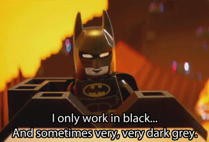

[<h1 align="center">Hi 👋, I'm Krunal Badami</h1>](https://krunalbadami.herokuapp.com/)
<!--

  

  

-->

  
  

<h3 align="center">A passionate certified JavaScript developer from Surat (🇮🇳</h3>

I love building applications & discussing new product ideas.✌️

## Skills and Experience is 3 years+

 
   
   
   
   
   
   
   
   
   
   
   
   
   
   
   
   

## My Certification(s):
* [Microsoft Certified JavaScript Associate](https://www.linkedin.com/feed/update/urn:li:activity:6687985148845195264/)

## Here are some ideas to get you started:
- 🔭 I’m currently working on **React and React Native. Yeah means I am on front-end side! Woohoo!**
- 🌱 I’m currently learning **JavaScript, TypeScript, React and ReactNative**
- 👯 I’m looking to collaborate on **... well don't know as of now. Still trying some collaboration in some packages!**
- 🤝 I’m looking for help with **anything you have to share which is based on JavaScript**
- 👨‍💻 All of my projects are available at [my github profile](https://github.com/krunalbad?tab=repositories)
- 📝 I write articles on [my company's blog portal](https://blog.logicwind.com/author/krunal-badami/)
- 💬 Ask me about **javascript, react, react-native**
- 📫 How to reach me **[LinkedIn](https://www.linkedin.com/in/krunalbadami/)**
- 🌏 My Website **[click here to see the awesomeness](https://krunalbadami.herokuapp.com/)**
- 📄 Know about my experiences [Beware! This will automatically download my resume in PDF](http://krunalbadami.herokuapp.com/profile/Krunal%20Badami's%20Profile.pdf)
- ⚡ Fun fact **... Evolving just confused!**

## Here are some of my contributions: (some maybe still under review, idk...)
- 📋 [netguru/sticky-parallax-header](https://github.com/netguru/sticky-parallax-header) 
- 📷 [react-native-toolkit/react-native-better-image](https://github.com/react-native-toolkit/react-native-better-image) 
- 🔊 [tanguyantoine/react-native-music-control](https://github.com/tanguyantoine/react-native-music-control)
- 🍎 [gazedash/react-native-airplay-ios](https://github.com/gazedash/react-native-airplay-ios)
- 🎨 [GeekyAnts/NativeBase](https://github.com/GeekyAnts/NativeBase)
- 📱 [ovr/react-native-status-bar-height](https://github.com/ovr/react-native-status-bar-height)

## Here are some of my work: (some maybe still under in progress, idk...)
<!-- 
- 🏖 react-native-perfect-image
- 🎥 react-native-video-scrubber
-->
- 📃 [Profile Generator](https://krunalbadami.herokuapp.com/resume/)
- 🔗 [Shortlink Generator](https://krunalbadami.herokuapp.com/short_link/)
- 🤑 [Bitcoin Calculator](https://bitkoin-crypto.herokuapp.com/)

## [Awarded Badges](https://www.credly.com/badges/2fe62e88-3c99-425b-ac94-bddc507f95c3):

  

## Visitor's Count:

 

## Github's Stats:

_NOTE: These stats does not indicate my skill level or something like that, it's just a github metric of which languages I have the most code on github and elsewhere, it's a feature of github-readme-stats_

<h3 align="left">Connect with me:</h3>

<h3 align="left">Support:</h3>

  

