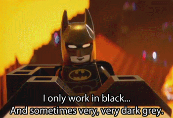

<!-- ========================= -->
<!--      KRUNAL BADAMI       -->
<!-- ========================= -->

  

<!-- Typing Animation -->

  

<!-- Fun GIF (make sure this file exists in your repo or use a full URL) -->

  

<!-- Social Links -->

  
  
  

  

---

## 👨‍💻 About

I’m **Krunal Badami**, a senior developer with deep experience in:

- **React Native** for Android & iOS  
- **Roku app development** (BrightScript + SceneGraph)  
- **Android TV & Apple TV** applications  
- **OTT / media streaming platforms**  
- **High-performance, product-focused UI/UX** for mobile and big screens  

I ship production-grade **streaming apps**, handle **HLS/DASH** video pipelines, and optimize for **performance, memory, and smooth D-pad navigation** across TV and mobile.

> Keywords around my work: _React Native developer India, Roku developer, TV app developer, BrightScript engineer, streaming app engineer, OTT app specialist_.

---

## 🚀 Tech Stack

🧩 Languages, Frameworks & Platforms

  
  
  
  
  
  
  
  

  
  
  
  
  

  
  
  
  

🧱 State Management & Navigation

  
  
  
  

📺 Media, Ads & Analytics

  
  
  
  

🧑‍💼 Leadership & Collaboration

  
  
  
  

---

## 📺 TV & OTT App Expertise

I focus heavily on **TV apps and streaming experiences**:

- End-to-end **Roku channel development** using BrightScript + SceneGraph  
- **Android TV & Apple TV** navigation (D-pad, focus engine, remote interactions)  
- Custom **video players** with HLS/DASH, DRM, trick-play, and robust error handling  
- **OTT subscription flows**, authentication, entitlement, and deep linking  
- Performance tuning for **low-latency, crash-free TV apps** at scale  

If you’re building or scaling a **React Native + Roku + TV app** stack, that’s exactly where I work.

---

## 📱 Mobile App Expertise

I focus heavily on **mobile apps and user experiences**:

- End-to-end **React Native development** for Android & iOS  
- **High-performance UI/UX** for mobile screens (touch, gestures, animations)  
- Custom **components** with Redux/MobX, React Navigation  
- **Cross-platform** apps with native performance and smooth interactions  
- Integration with **Firebase**, **GraphQL**, analytics, and ads  
- Performance tuning for **smooth, battery-efficient mobile apps** at scale  

If you’re building or scaling a **React Native mobile app**, that’s exactly where I work.

---

## 🛠 Open Source & Community

### Here are some of my contributions (some may still be under review):

- 📋 [netguru/sticky-parallax-header](https://github.com/netguru/sticky-parallax-header/pulls?q=is%3Apr+author%3Akrunalbad+)  
- 📷 [react-native-toolkit/react-native-better-image](https://github.com/react-native-toolkit/react-native-better-image/pulls?q=is%3Apr+author%3Akrunalbad+)  
- 🔊 [tanguyantoine/react-native-music-control](https://github.com/tanguyantoine/react-native-music-control/pulls?q=is%3Apr+author%3Akrunalbad+)  
- 🍎 [gazedash/react-native-airplay-ios](https://github.com/gazedash/react-native-airplay-ios/pulls?q=is%3Apr+author%3Akrunalbad+)  
- 🎨 [GeekyAnts/NativeBase](https://github.com/GeekyAnts/NativeBase/pulls?q=is%3Apr+author%3Akrunalbad+) (Pending)  
- 📱 [ovr/react-native-status-bar-height](https://github.com/ovr/react-native-status-bar-height/pulls?q=is%3Apr+author%3Akrunalbad+) (Pending)  
- 🖼️ [Gustash/react-native-giphy-keyboard](https://github.com/Gustash/react-native-giphy-keyboard/pulls?q=is%3Apr+author%3Abharamalhusen+) (Pending)  

More on my profile: **https://github.com/krunalbad**

---

## 📂 Selected Projects

- **Profile Generator** — multiple resume/profile formats  
  https://krunalbadami.herokuapp.com/resume/  

- **Short Link Generator**  
  https://krunalbadami.herokuapp.com/short_link/  

- **Bitcoin Calculator**  
  https://bitkoin-crypto.herokuapp.com/  

---

## 📊 GitHub Overview

### Additional Metrics

  
  
  
  

### Streak

  

### Trophies

  

### Activity Graph

  

<!--
### Contribution Calendar (WakaTime)
Uncomment this section only if you have WakaTime configured for username "krunalbad".

  

-->

---

## 🎮 Fun Zone

### Random Dev Joke

  

### Pixel Avatar

  

---

## 🕹️ Mini Games (Quick Breaks)

These are external games you can open in a new tab when you need a break:

- 🐍 [GitHub-style Snake Game](https://playsnake.org/)  
- 🦖 [Chrome Dino Runner](https://chromedino.com/)  
- ❌⭕ [Tic-Tac-Toe](https://playtictactoe.org/)  

---

## 📫 Contact

- Portfolio: **https://krunalbad.github.io**  
- Telegram: **@thatrokuguy**  
- LinkedIn: **https://linkedin.com/in/krunalbadami**
